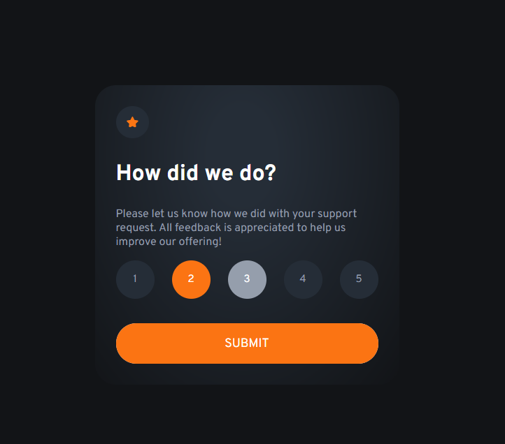

# Frontend Mentor - Interactive rating component solution

This is a solution to the [Interactive rating component challenge on Frontend Mentor](https://www.frontendmentor.io/challenges/interactive-rating-component-koxpeBUmI). Frontend Mentor challenges help you improve your coding skills by building realistic projects. 

## Table of contents

- [Overview](#overview)
  - [The challenge](#the-challenge)
  - [Screenshot](#screenshot)
  - [Links](#links)
- [My process](#my-process)
  - [What I learned](#what-i-learned)

## Overview

### The challenge

Users should be able to:

- See hover states for all interactive elements on the page
- Select and submit a number rating
- See the "Thank you" card state after submitting a rating

### Screenshot

### Links

- Solution URL: [Add solution URL here](https://your-solution-url.com)
- Live Site URL: [Add live site URL here](https://interactive-rating-component-gold-six.vercel.app/)

## My process
   I must say that the experience was both challenging and rewarding. While working on the project, I faced a few difficulties, particularly with JavaScript. I struggled with accessing the value in radio buttons. It took me longer than I expected.

Another hard part was styling the radio buttons. I discovered that they can't be styled by themselves, so I hide the element and used pseudo-element *:before* to create a button that can be styled.

### Built with

- CSS custom properties
- Pseudo-elemnts

### What I learned

 - get data from forms with JS
 - Style radio buttons with pseudo elements
 - Style elements using JS

